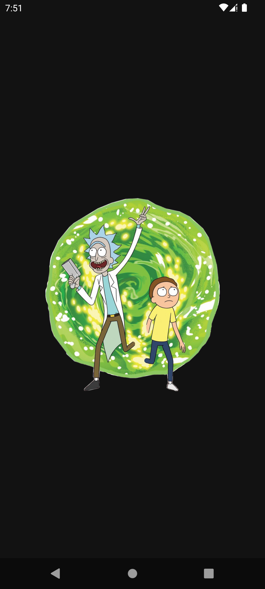
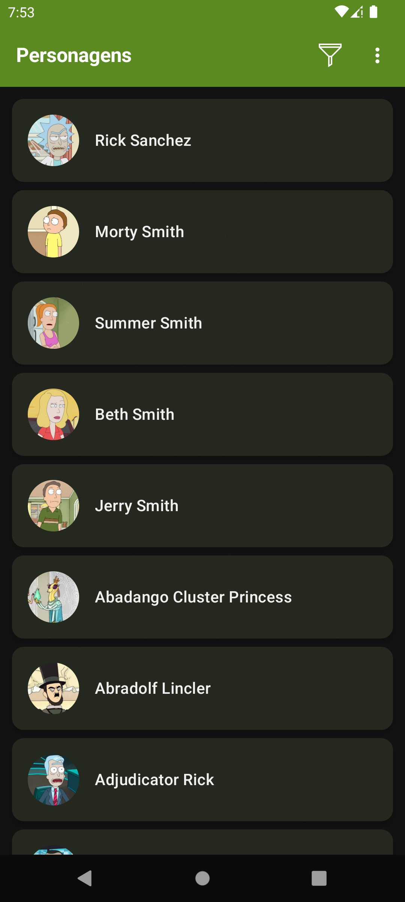
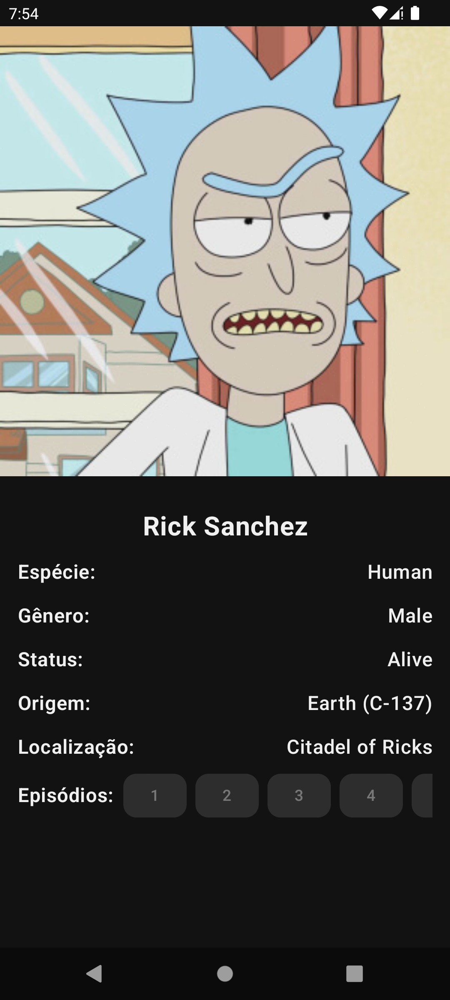
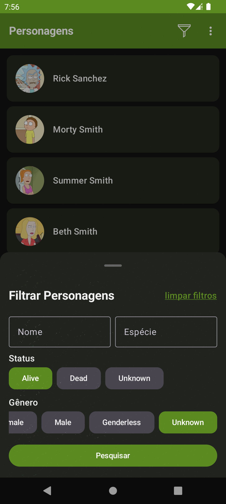

# Rick & Morty App

   

## Sobre o Projeto

Este é um aplicativo Android desenvolvido como parte do **desafio técnico da Stone** para a posição de **Desenvolvedor Android**.

O app consome a **API pública do Rick & Morty** (`https://rickandmortyapi.com/`) para exibir uma **lista paginada de personagens** e seus detalhes.

| Splash Screen                       | Lista de Personagens              | Tela de Detalhes                        | Filtros                               |
|-------------------------------------|-----------------------------------|-----------------------------------------|---------------------------------------|
|  |  |  |  |

---

## Funcionalidades

- Listagem de personagens com paginação (infinite scroll).
- Tela de detalhes de cada personagem, exibindo imagem, nome, espécie, gênero, status, origem, localização e episódios.
- Filtros para buscar personagens por nome, espécie, status e gênero.
- Suporte à rotação de tela (portrait e landscape).
- Modo offline (cache dos personagens e detalhes via Room).
- Testes unitários e de UI garantindo a qualidade do código.
- Interface moderna e responsiva usando **Jetpack Compose**.
- Temas de cores para Light Mode, Dark Mode e também Alto Contraste para usuários com visão debilitada.

---

## Tecnologias Utilizadas

| Tecnologia                          | Uso no Projeto                               |
|-------------------------------------|----------------------------------------------|
| **Kotlin**                          | Linguagem principal                          |
| **Jetpack Compose**                 | UI declarativa e moderna                     |
| **MVVM + Clean Architecture**       | Organização e separação de responsabilidades |
| **Koin**                            | Injeção de dependências                      |
| **Retrofit + Gson**                 | Consumo da API REST                          |
| **Paging 3**                        | Paginação de personagens                     |
| **Room Database**                   | Cache local dos personagens                  |
| **Coroutines + Flow**               | Programação assíncrona                       |
| **MockK + JUnit + Compose UI Test** | Testes unitários e de UI                     |

---

## Arquitetura e Estrutura do Código

O projeto segue a arquitetura **MVVM + Clean Architecture**, garantindo código modular, reutilizável e de fácil manutenção.

### Estrutura de diretórios

- `data/` → Contém a lógica de acesso a dados (API, Banco de Dados, Repositórios).
- `domain/` → Define os casos de uso (`UseCases`) e os modelos de dados.
- `presentation/` → Contém toda a interface do usuário (UI), incluindo telas e ViewModels.
- `di/` → Configuração da injeção de dependências usando Koin.

---

## Decisões Técnicas

Durante o desenvolvimento, foram adotadas as seguintes estratégias:

- **Jetpack Compose** → Escolhido para criar uma UI declarativa e responsiva.
- **MVVM + Clean Architecture** → Separação de responsabilidades e código escalável.
- **Koin para DI** → Injeção de dependências simples e eficiente.
- **Room Database** → Implementado para permitir **modo offline** e melhor experiência do usuário.
- **Paging 3** → Gerenciamento de paginação da API.
- **Testes completos** → Testes **unitários** para lógica de negócio e **UI Tests** para interface.

---

## Melhorias Futuras

- Animações na UI para melhorar a experiência do usuário.
- Adicionar os outros dois módulos da API (episodes e locations) e fazê-los interagirem com o módulo atual (characters).
- Refatorar usando KMP, para que o app também seja disponibilizado para iOS.

---

## Licença

Este projeto é de uso exclusivo para o **desafio técnico da Stone**.

---

## Considerações Finais

O projeto foi desenvolvido com as melhores práticas e tecnologias modernas para garantir **performance, manutenibilidade e escalabilidade**.  
